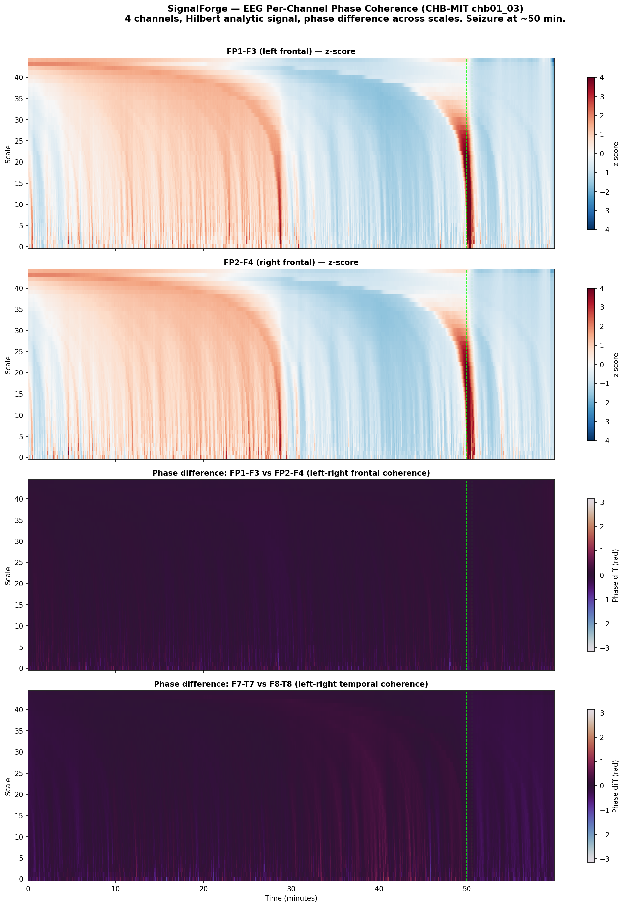

# SignalForge

See the structure in any data, across every scale, instantly.

> **Looking for the fast path?** Read [docs/distill_quickstart.md](docs/distill_quickstart.md) — three commands, ML-ready feature matrices from any ordered dataset.

## Install

```bash
pip install adelic-signalforge
```

## Quick Start

```bash
# Download sample data (VIX volatility index, 2005-2012)
curl -o vix.csv "https://fred.stlouisfed.org/graph/fredgraph.csv?id=VIXCLS&cosd=2005-01-01&coed=2012-12-31"

# See the structure
sf surface vix.csv -hm --max-window 360
```


The 2008 financial crisis — visible across every scale at once.

## Your data

```bash
sf schema mydata.csv                    # infer the structure
sf surface mydata.csv --schema my.schema.json -hm   # see it
```

Any CSV works. Multi-column, multi-channel, per-entity — [sf schema](https://github.com/adelic-ai/signalforge/blob/main/docs/your-data.md) figures it out.

## Explore

```bash
sf surface data.csv -hm --baseline ewma --residual z    # what's anomalous?
sf surface data.csv -hm --start-date 2008-01 --end-date 2009-06  # zoom in
sf inspect ewma                                          # how does this work?
sf inspect                                               # what's available?
```

The CLI suggests what to try next. Every output leads somewhere.

## Python API

```python
import signalforge as sf

surfaces = (
    sf.load("data.csv")
    .measure(windows=[10, 60, 360])
    .baseline("ewma", alpha=0.1)
    .residual("z")
    .surfaces()
)
```

For branching and merging — multiple baselines, stacked features:

```python
from signalforge.graph import Input, Measure, Baseline, Residual, Stack, Pipeline

x = Input()
m = Measure()(x)
bl = Baseline("ewma", alpha=0.1)(m)
r = Residual("z")(m, bl)
features = Stack()([m, r])
pipe = Pipeline(x, features)
result = pipe.run(records, windows=[10, 60, 360])
```

## Custom aggregations

Each surface cell reduces a window to a number — by default a mean. SF ships with 20+ aggregations (mean, std, percentiles, spectral energy, dominant frequency, Shannon entropy, ...) and you can add your own:

```python
from signalforge.pipeline.aggregation import register_aggregation

@register_aggregation("iqr")
def iqr(values):
    return float(np.percentile(values, 75) - np.percentile(values, 25))
```

## Across domains

The same pipeline processes financial data, EEG brain recordings, satellite gravity measurements, and generic time series — unchanged.



EEG seizure detection: the top panels show amplitude, the bottom panels show phase relationships between brain hemispheres. The seizure disrupts both — but the phase change is only visible with complex-valued analysis.

## Documentation

| | |
|---|---|
| **[Distill Quickstart](docs/distill_quickstart.md)** | **Trend-finding in any ordered data — start here** |
| [Quick Start](docs/quickstart.md) | Zero to heatmap |
| [Your Data](docs/your-data.md) | Bring your own data |
| [CLI](docs/cli.md) | All commands |
| [Python API](docs/python-api.md) | Chaining and DAG |
| [Examples](docs/examples.md) | VIX, EEG, GRACE, INTERMAGNET |
| [Concepts](docs/concepts.md) | How it works |
| [Comparison](docs/comparison.md) | vs STFT, wavelets, EMD |

## License

Business Source License 1.1. See [LICENSE](LICENSE).

Free for non-commercial use. Commercial use requires a license from Adelic — contact [shun.honda@adelic.org](mailto:shun.honda@adelic.org). Converts to Apache 2.0 on 2029-03-22.
