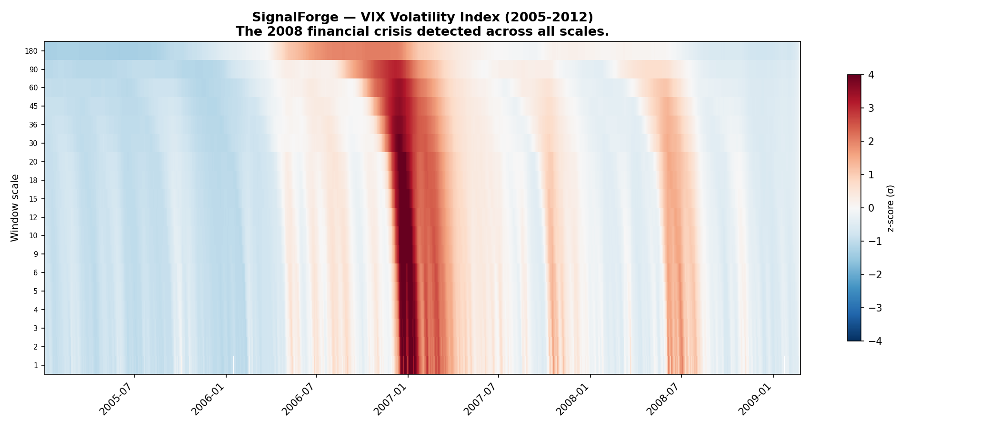
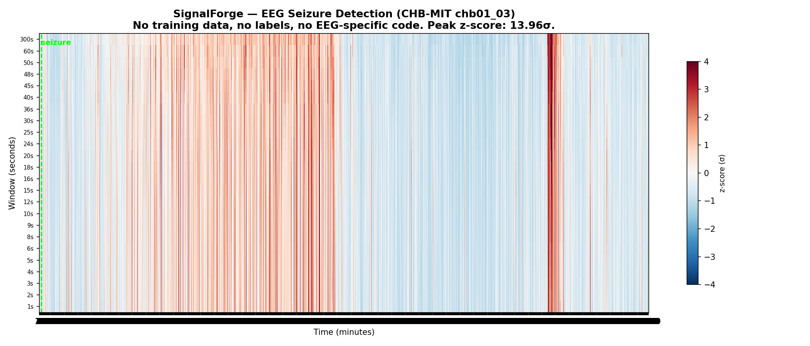

# SignalForge

Multiscale signal analysis on a [normalized scale space](docs/concepts.md).
Give it any ordered sequence and explore its structure across scales — no labels, no training, no domain-specific code.

## Table of Contents

- [Install](#install)
- [Quick Start](#quick-start)
- [Explore Your Data](#explore-your-data)
- [Python API](#python-api)
- [What Makes This Different](#what-makes-this-different)
- [Demonstrated Results](#demonstrated-results)
- [Documentation](#documentation)
- [License](#license)

## Install

```bash
pip install adelic-signalforge
```

Or from source:

```bash
git clone https://github.com/adelic-ai/signalforge
cd signalforge
uv sync
```

## Quick Start

```bash
# Download VIX volatility data (2005-2012)
curl -o vix.csv "https://fred.stlouisfed.org/graph/fredgraph.csv?id=VIXCLS&cosd=2005-01-01&coed=2012-12-31"

# See the structure
sf surface vix.csv -hm --max-window 360
```



The 2008 financial crisis appears as a vertical band of red — visible across every analysis scale simultaneously. No configuration, no parameters to tune. SignalForge [derives the measurement space](docs/concepts.md#lattice) from your data.

## Explore Your Data

### Load and inspect

```bash
sf load vix.csv
```

```
  SignalForge  vix.csv
  ────────────────────────────────────────
  records   2,013
  channels  value
  span      0 .. 2,085  (2,085)
  grain     2  (estimated)
  basis     2^2 x 3^2 x 5
  scales    18  [2 .. 360]
  ────────────────────────────────────────

  Next:
    sf surface vix.csv -hm
```

### Add a baseline

What's anomalous relative to a [moving average](docs/cli.md#baselines)?

```bash
sf surface vix.csv -hm --max-window 360 --baseline ewma --residual z
```

The residual shows how many standard deviations each point is from the baseline, at every scale. `sf inspect ewma` explains the method, its formula, and when to use it.

### Zoom in

Spotted something? The CLI suggests a zoom command centered on the peak anomaly:

```bash
sf surface vix.csv -hm --start-date 2007-06-01 --end-date 2009-06-01
```

Zoomed regions get [finer resolution automatically](docs/cli.md#zoom) — more scales, smaller grain. Coarse-to-fine exploration is the natural workflow.

### Learn the system

```bash
sf inspect
```

```
  Baselines
    ewma            Exponentially Weighted Moving Average
    median          Rolling Median Filter
    rolling_mean    Rolling Mean

  Residuals
    difference      Difference Residual
    ratio           Ratio Residual
    z               Z-Score Residual

  Concepts
    horizon         Horizon
    grain           Grain
    surface         Surface
    lattice         Lattice
```

`sf inspect <name>` shows the formula, parameters, when to use it, and an example command. The CLI [teaches the system by letting you use it](docs/cli.md#inspect).

### Set up a workspace

For sustained exploration, [initialize a workspace](docs/cli.md#workspace):

```bash
sf init my_project --csv vix.csv --max-window 360
cd my_project
sf surface -hm                                        # picks up workspace config
sf surface -hm --baseline ewma --residual z --name crisis_ewma   # saves the run
sf status                                              # see what you've done
```

## Python API

### Chaining — quick exploration

```python
import signalforge as sf

surfaces = (
    sf.load("vix.csv")
    .measure(windows=[10, 60, 360])
    .baseline("ewma", alpha=0.1)
    .residual("z")
    .surfaces()
)
```

Each step returns a new chain. Nothing executes until `.surfaces()` or `.run()`. See the [Python API guide](docs/python-api.md) for details.

### DAG — full composition

When you need branching and merging — multiple baselines, Hilbert transform, stacked features for ML:

```python
from signalforge.graph import Input, Measure, Baseline, Residual, Hilbert, Stack, Pipeline

x = Input()
m = Measure()(x)

bl = Baseline(method="ewma", alpha=0.1)(m)
resid = Residual(mode="z")(m, bl)
hilbert = Hilbert()(m)

features = Stack()([m, resid, hilbert])

pipe = Pipeline(x, features)
result = pipe.run(records, windows=[10, 60, 360])
```

The [graph API](docs/python-api.md#dag-composition) composes operators into a lazy DAG. Use the chaining API to figure out what works, then lock it into a DAG for production or ML pipelines.

### Signals and surfaces

Everything in SignalForge is a [LatticeSignal](docs/concepts.md#signals) — including surfaces. A surface IS a signal, so you can measure surfaces of surfaces, compute baselines of baselines, or feed any intermediate back through the pipeline.

```python
from signalforge.signal import RealSignal, ComplexSignal

sig = RealSignal(index, values, channel="my_signal")
surface = sf.from_signal(sig).measure(windows=[10, 30, 90]).surfaces()[0]
```

Values are complex-native (`complex128`). Real signals are the common case (`imag=0`). The [Hilbert transform](docs/python-api.md#hilbert) promotes a real signal to its analytic (complex) form — amplitude + phase at every point.

### Custom aggregations

Each surface cell is a window reduced to a number — by default a mean. SignalForge ships with 20+ aggregations (mean, std, percentiles, spectral energy, dominant frequency, Shannon entropy, ...) and you can register your own:

```python
from signalforge.pipeline.aggregation import register_aggregation

@register_aggregation("iqr")
def iqr(values):
    return float(np.percentile(values, 75) - np.percentile(values, 25))
```

Any function that takes an array and returns a float works. See [docs/python-api.md](docs/python-api.md#aggregations) for the full list.

## What Makes This Different

Standard multiscale analysis (STFT, wavelets) requires the analyst to choose window sizes. SignalForge [derives the measurement space](docs/concepts.md#lattice) from the arithmetic of your declared windows and grain. The valid scales are the divisors of the horizon — a structure from number theory that guarantees:

- **Artifact-free tiling** — windows nest perfectly, no boundary effects
- **Structural invariance** — same plan = same grid. Surfaces from different signals are [directly comparable](docs/concepts.md#structural-invariance)
- **Scale coherence** — every scale is a divisor of every larger scale. The lattice IS the multiscale structure

Two signals with the same sampling plan produce identically shaped surfaces. This is what makes ML on surfaces meaningful — features at each scale occupy the same structural position.

For a detailed comparison with wavelets, STFT, and EMD: [docs/comparison.md](docs/comparison.md)

## Demonstrated Results

### EEG seizure detection



SignalForge detected a clinical epileptic seizure at **13.96σ** on [CHB-MIT EEG](https://physionet.org/content/chbmit/1.0.0/) data — the windowed mean during the seizure deviated nearly 14 standard deviations from the scale baseline. No training data, no labels, no EEG-specific code.

The same pipeline processes VIX market data, [INTERMAGNET](https://intermagnet.org/data_download.html) geomagnetic observatory data, and generic CSV time series unchanged.

See [docs/examples.md](docs/examples.md) for full walkthroughs with each dataset.

## Documentation

| Doc | What it covers |
|-----|----------------|
| [Concepts](docs/concepts.md) | Lattice, horizon, grain, surface, signals, structural invariance |
| [CLI Guide](docs/cli.md) | All commands: load, surface, inspect, init, status, zoom |
| [Python API](docs/python-api.md) | Chaining API, DAG composition, Hilbert, signals |
| [Examples](docs/examples.md) | VIX, EEG, INTERMAGNET walkthroughs |
| [Comparison](docs/comparison.md) | STFT, wavelets, EMD vs SignalForge |
| [Architecture](docs/architecture.md) | Signal module, graph, pipeline internals |

## License

Business Source License 1.1. See [LICENSE](LICENSE).

Free for non-commercial use (research, personal projects, evaluation).
Commercial use requires a license from Adelic — contact [shun.honda@adelic.org](mailto:shun.honda@adelic.org).

Converts to Apache 2.0 on 2029-03-22.

## Citation

If you use SignalForge in published work, a citation entry will be available once the arXiv preprint is posted.
