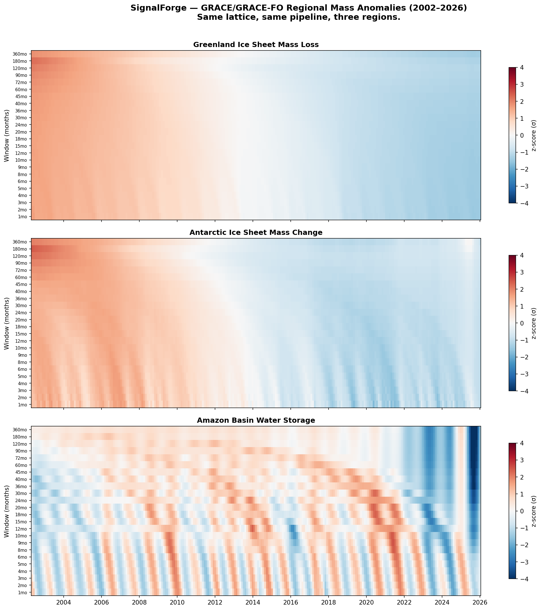

# Examples

Same pipeline, different data. These are the built-in examples — one command each. The [community gallery](https://github.com/adelic-ai/signalforge/discussions) (coming soon) will have more from users.

## Table of Contents

- [VIX Volatility Index](#vix-volatility-index) — financial regime change
- [EEG Seizure Detection](#eeg-seizure-detection) — clinical neuroscience
- [INTERMAGNET Geomagnetic Data](#intermagnet-geomagnetic-data) — earth science
- [GRACE/GRACE-FO Satellite Gravity](#gracegrace-fo-satellite-gravity) — ice mass, hydrology
- [Generic Time Series](#generic-time-series) — any two-column CSV

---

## VIX Volatility Index

Daily CBOE Volatility Index, 2005-2012. The 2008 financial crisis as a regime change detection problem.

### Get the data

```bash
curl -o vix.csv "https://fred.stlouisfed.org/graph/fredgraph.csv?id=VIXCLS&cosd=2005-01-01&coed=2012-12-31"
```

### CLI

```bash
sf load vix.csv
sf surface vix.csv -hm --max-window 360
sf surface vix.csv -hm --max-window 360 --baseline ewma --residual z
sf surface vix.csv -hm --start-date 2007-06-01 --end-date 2009-06-01
```

### Python

```python
import signalforge as sf

# Quick exploration
surfaces = (
    sf.load("vix.csv")
    .measure(windows=[10, 30, 60, 90, 180, 360])
    .baseline("ewma", alpha=0.1)
    .residual("z")
    .surfaces()
)

# The 2008 crisis appears as a broad vertical band of high z-scores
# across all scales — a regime change visible simultaneously at every
# analysis resolution.
```

**What it shows:** SignalForge detects regime changes in financial time series without knowing what a "regime" is. The 2008 crisis is visible across every scale — not because VIX spiked (that's one scale), but because the entire multiscale structure of the signal changed.

---

## EEG Seizure Detection

CHB-MIT Scalp EEG Database, patient chb01, recording chb01_03. One hour at 256 Hz, 23 channels collapsed to RMS.

### Get the data

```bash
# Download from PhysioNet
# https://physionet.org/content/chbmit/1.0.0/
# Then preprocess:
python notes/eeg_chbmit/edf_to_helix_signal.py
```

### CLI

```bash
sf surface notes/eeg_chbmit/chb01_03_eeg_rms.csv --max-window 360 -hm
```

### Python

```python
import signalforge as sf
from signalforge.domains import eeg

records = eeg.ingest("notes/eeg_chbmit/chb01_03_eeg_rms.csv")

# With Hilbert — amplitude and phase structure
surfaces = (
    sf.load(records)
    .measure(windows=[256, 1024, 4096, 15360])
    .hilbert()
    .surfaces()
)
# surfaces[0].data includes 'amplitude', 'phase', 'inst_freq'
```

**What it shows:** A clinical epileptic seizure detected at **13.96σ** — nearly 14 standard deviations from the scale baseline. No training data, no labels, no EEG-specific code. The seizure window (2996-3036 seconds) appears as a bright band in the heatmap, visible across all scales simultaneously.

---

## INTERMAGNET Geomagnetic Data

Yellowknife observatory, minute-resolution magnetic field measurements.

### Get the data

```bash
# Download from INTERMAGNET
# https://intermagnet.org/data_download.html
# Convert IAGA2002 format:
python examples/iaga2002_to_csv.py input.iaga output.csv
```

### CLI

```bash
sf load yellowknife.csv
sf surface yellowknife.csv -hm --max-window 1440
```

### Python

```python
from signalforge.domains import intermagnet

records = intermagnet.ingest("yellowknife.csv")
plan = intermagnet.sampling_plan()
```

**What it shows:** Geomagnetic storms produce the same kind of multiscale signature as EEG seizures — a ridge in scale space at the storm's characteristic duration. The same pipeline, the same analysis, different domain.

---

## GRACE/GRACE-FO Satellite Gravity

Monthly gravity anomalies from NASA's GRACE and GRACE-FO missions, 2002-2026. Equivalent water height in cm.

### Get the data

Download from [NASA PO.DAAC](https://podaac.jpl.nasa.gov/dataset/TELLUS_GRAC-GRFO_MASCON_CRI_GRID_RL06.3_V4) (free EarthData account required). The netCDF file contains a global 0.5° grid with 253 monthly time steps.

### Python

```python
import signalforge as sf

# Regional time series already extracted in data/grace_regions.csv
surfaces = sf.load("data/grace_regions.csv").measure().surfaces()
```

**What it shows:** Three regions on the same lattice reveal fundamentally different multiscale structure. Greenland shows persistent ice mass loss accelerating over 24 years. Antarctica shows subtler change. The Amazon shows seasonal wet/dry oscillation with the 2023 drought visible as a deep anomaly at coarse scales.



---

## Generic Time Series

Any two-column CSV (date/index + value) works with no configuration.

```bash
sf load my_data.csv
sf surface my_data.csv -hm
```

Auto-detected. No schema, no adapter, no setup.

For multi-column data, see [Your Data](your-data.md) — `sf schema` handles it.
